<!-- markdownlint-capture -->
<!-- markdownlint-disable -->

# Code Metrics

This file is dynamically maintained by a bot, *please do not* edit this by hand. It represents various [code metrics](https://aka.ms/dotnet/code-metrics), such as cyclomatic complexity, maintainability index, and so on.

## MyJetWallet.Fireblocks.Domain.Models :question:

The *MyJetWallet.Fireblocks.Domain.Models.csproj* project file contains:

- 0 namespaces.
- 0 named types.
- 0 total lines of source code.
- Approximately 0 lines of executable code.
- The highest cyclomatic complexity is 0 :question:.

<a href="#myjetwallet-fireblocks-domain-models">:top: back to MyJetWallet.Fireblocks.Domain.Models</a>

## MyJetWallet.Fireblocks.Domain :question:

The *MyJetWallet.Fireblocks.Domain.csproj* project file contains:

- 0 namespaces.
- 0 named types.
- 0 total lines of source code.
- Approximately 0 lines of executable code.
- The highest cyclomatic complexity is 0 :question:.

<a href="#myjetwallet-fireblocks-domain">:top: back to MyJetWallet.Fireblocks.Domain</a>

## MyJetWallet.Fireblocks :heavy_check_mark:

The *MyJetWallet.Fireblocks.csproj* project file contains:

- 7 namespaces.
- 16 named types.
- 390 total lines of source code.
- Approximately 158 lines of executable code.
- The highest cyclomatic complexity is 2 :heavy_check_mark:.

  <strong id="myjetwallet-fireblocks-domain-models-addresses">
    MyJetWallet.Fireblocks.Domain.Models.Addresses :heavy_check_mark:
  </strong>

 

The `MyJetWallet.Fireblocks.Domain.Models.Addresses` namespace contains 1 named types.

- 1 named types.
- 21 total lines of source code.
- Approximately 10 lines of executable code.
- The highest cyclomatic complexity is 2 :heavy_check_mark:.

  <strong id="vaultaddress">
    VaultAddress :heavy_check_mark:
  </strong>

 

- The `VaultAddress` contains 5 members.
- 18 total lines of source code.
- Approximately 10 lines of executable code.
- The highest cyclomatic complexity is 2 :heavy_check_mark:.

| Member kind | Line number | Maintainability index | Cyclomatic complexity | Depth of inheritance | Class coupling | Lines of source / executable code |
| :-: | :-: | :-: | :-: | :-: | :-: | :-: |
| Property | <a href='https://github.com/MyJetWallet/MyJetWallet.Fireblocks/blob/master/src/MyJetWallet.Fireblocks/Domain/Models/Addresses/VaultAddress.cs#L10' title='string VaultAddress.Address'>10</a> | 100 | 2 :heavy_check_mark: | 0 | 2 | 2 / 2 |
| Property | <a href='https://github.com/MyJetWallet/MyJetWallet.Fireblocks/blob/master/src/MyJetWallet.Fireblocks/Domain/Models/Addresses/VaultAddress.cs#L22' title='decimal VaultAddress.Bip44AddressIndex'>22</a> | 100 | 2 :heavy_check_mark: | 0 | 3 | 2 / 2 |
| Property | <a href='https://github.com/MyJetWallet/MyJetWallet.Fireblocks/blob/master/src/MyJetWallet.Fireblocks/Domain/Models/Addresses/VaultAddress.cs#L16' title='string VaultAddress.EnterpriseAddress'>16</a> | 100 | 2 :heavy_check_mark: | 0 | 2 | 2 / 2 |
| Property | <a href='https://github.com/MyJetWallet/MyJetWallet.Fireblocks/blob/master/src/MyJetWallet.Fireblocks/Domain/Models/Addresses/VaultAddress.cs#L13' title='string VaultAddress.LegacyAddress'>13</a> | 100 | 2 :heavy_check_mark: | 0 | 2 | 2 / 2 |
| Property | <a href='https://github.com/MyJetWallet/MyJetWallet.Fireblocks/blob/master/src/MyJetWallet.Fireblocks/Domain/Models/Addresses/VaultAddress.cs#L19' title='string VaultAddress.Tag'>19</a> | 100 | 2 :heavy_check_mark: | 0 | 2 | 2 / 2 |

<a href="#VaultAddress-class-diagram">:link: to `VaultAddress` class diagram</a>

<a href="#myjetwallet-fireblocks-domain-models-addresses">:top: back to MyJetWallet.Fireblocks.Domain.Models.Addresses</a>

  <strong id="myjetwallet-fireblocks-domain-models-assetmappngs">
    MyJetWallet.Fireblocks.Domain.Models.AssetMappngs :heavy_check_mark:
  </strong>

 

The `MyJetWallet.Fireblocks.Domain.Models.AssetMappngs` namespace contains 2 named types.

- 2 named types.
- 58 total lines of source code.
- Approximately 28 lines of executable code.
- The highest cyclomatic complexity is 2 :heavy_check_mark:.

  <strong id="assetmapping">
    AssetMapping :heavy_check_mark:
  </strong>

 

- The `AssetMapping` contains 14 members.
- 46 total lines of source code.
- Approximately 28 lines of executable code.
- The highest cyclomatic complexity is 2 :heavy_check_mark:.

| Member kind | Line number | Maintainability index | Cyclomatic complexity | Depth of inheritance | Class coupling | Lines of source / executable code |
| :-: | :-: | :-: | :-: | :-: | :-: | :-: |
| Property | <a href='https://github.com/MyJetWallet/MyJetWallet.Fireblocks/blob/master/src/MyJetWallet.Fireblocks/Domain/Models/AssetMappngs/AssetMapping.cs#L23' title='string AssetMapping.ActiveDepositAddessVaultAccountId'>23</a> | 100 | 2 :heavy_check_mark: | 0 | 2 | 2 / 2 |
| Property | <a href='https://github.com/MyJetWallet/MyJetWallet.Fireblocks/blob/master/src/MyJetWallet.Fireblocks/Domain/Models/AssetMappngs/AssetMapping.cs#L11' title='string AssetMapping.AssetId'>11</a> | 100 | 2 :heavy_check_mark: | 0 | 2 | 2 / 2 |
| Property | <a href='https://github.com/MyJetWallet/MyJetWallet.Fireblocks/blob/master/src/MyJetWallet.Fireblocks/Domain/Models/AssetMappngs/AssetMapping.cs#L20' title='DepositType AssetMapping.DepositType'>20</a> | 100 | 2 :heavy_check_mark: | 0 | 3 | 2 / 2 |
| Property | <a href='https://github.com/MyJetWallet/MyJetWallet.Fireblocks/blob/master/src/MyJetWallet.Fireblocks/Domain/Models/AssetMappngs/AssetMapping.cs#L17' title='string AssetMapping.FireblocksAssetId'>17</a> | 100 | 2 :heavy_check_mark: | 0 | 2 | 2 / 2 |
| Property | <a href='https://github.com/MyJetWallet/MyJetWallet.Fireblocks/blob/master/src/MyJetWallet.Fireblocks/Domain/Models/AssetMappngs/AssetMapping.cs#L47' title='bool AssetMapping.IsDepositGenerationEnabled'>47</a> | 100 | 2 :heavy_check_mark: | 0 | 2 | 2 / 2 |
| Property | <a href='https://github.com/MyJetWallet/MyJetWallet.Fireblocks/blob/master/src/MyJetWallet.Fireblocks/Domain/Models/AssetMappngs/AssetMapping.cs#L41' title='bool AssetMapping.IsEstimationRequired'>41</a> | 100 | 2 :heavy_check_mark: | 0 | 2 | 2 / 2 |
| Property | <a href='https://github.com/MyJetWallet/MyJetWallet.Fireblocks/blob/master/src/MyJetWallet.Fireblocks/Domain/Models/AssetMappngs/AssetMapping.cs#L38' title='bool AssetMapping.IsGasRequired'>38</a> | 100 | 2 :heavy_check_mark: | 0 | 2 | 2 / 2 |
| Property | <a href='https://github.com/MyJetWallet/MyJetWallet.Fireblocks/blob/master/src/MyJetWallet.Fireblocks/Domain/Models/AssetMappngs/AssetMapping.cs#L44' title='bool AssetMapping.IsSettlementRequired'>44</a> | 100 | 2 :heavy_check_mark: | 0 | 2 | 2 / 2 |
| Property | <a href='https://github.com/MyJetWallet/MyJetWallet.Fireblocks/blob/master/src/MyJetWallet.Fireblocks/Domain/Models/AssetMappngs/AssetMapping.cs#L35' title='decimal AssetMapping.MaxGasAmount'>35</a> | 100 | 2 :heavy_check_mark: | 0 | 3 | 2 / 2 |
| Property | <a href='https://github.com/MyJetWallet/MyJetWallet.Fireblocks/blob/master/src/MyJetWallet.Fireblocks/Domain/Models/AssetMappngs/AssetMapping.cs#L29' title='decimal AssetMapping.MinAmountForAutoSettlement'>29</a> | 100 | 2 :heavy_check_mark: | 0 | 3 | 2 / 2 |
| Property | <a href='https://github.com/MyJetWallet/MyJetWallet.Fireblocks/blob/master/src/MyJetWallet.Fireblocks/Domain/Models/AssetMappngs/AssetMapping.cs#L32' title='decimal AssetMapping.MinGasAmount'>32</a> | 100 | 2 :heavy_check_mark: | 0 | 3 | 2 / 2 |
| Property | <a href='https://github.com/MyJetWallet/MyJetWallet.Fireblocks/blob/master/src/MyJetWallet.Fireblocks/Domain/Models/AssetMappngs/AssetMapping.cs#L14' title='string AssetMapping.NetworkId'>14</a> | 100 | 2 :heavy_check_mark: | 0 | 2 | 2 / 2 |
| Property | <a href='https://github.com/MyJetWallet/MyJetWallet.Fireblocks/blob/master/src/MyJetWallet.Fireblocks/Domain/Models/AssetMappngs/AssetMapping.cs#L50' title='string AssetMapping.SettlementVaultAccountId'>50</a> | 100 | 2 :heavy_check_mark: | 0 | 2 | 2 / 2 |
| Property | <a href='https://github.com/MyJetWallet/MyJetWallet.Fireblocks/blob/master/src/MyJetWallet.Fireblocks/Domain/Models/AssetMappngs/AssetMapping.cs#L26' title='string AssetMapping.WithdrawalVaultAccountId'>26</a> | 100 | 2 :heavy_check_mark: | 0 | 2 | 2 / 2 |

<a href="#AssetMapping-class-diagram">:link: to `AssetMapping` class diagram</a>

<a href="#myjetwallet-fireblocks-domain-models-assetmappngs">:top: back to MyJetWallet.Fireblocks.Domain.Models.AssetMappngs</a>

  <strong id="deposittype">
    DepositType :heavy_check_mark:
  </strong>

 

- The `DepositType` contains 2 members.
- 5 total lines of source code.
- Approximately 0 lines of executable code.
- The highest cyclomatic complexity is 0 :heavy_check_mark:.

| Member kind | Line number | Maintainability index | Cyclomatic complexity | Depth of inheritance | Class coupling | Lines of source / executable code |
| :-: | :-: | :-: | :-: | :-: | :-: | :-: |
| Field | <a href='https://github.com/MyJetWallet/MyJetWallet.Fireblocks/blob/master/src/MyJetWallet.Fireblocks/Domain/Models/AssetMappngs/DepositType.cs#L5' title='DepositType.Broker'>5</a> | 100 | 0 :heavy_check_mark: | 0 | 0 | 1 / 0 |
| Field | <a href='https://github.com/MyJetWallet/MyJetWallet.Fireblocks/blob/master/src/MyJetWallet.Fireblocks/Domain/Models/AssetMappngs/DepositType.cs#L6' title='DepositType.Intermediate'>6</a> | 100 | 0 :heavy_check_mark: | 0 | 0 | 1 / 0 |

<a href="#DepositType-class-diagram">:link: to `DepositType` class diagram</a>

<a href="#myjetwallet-fireblocks-domain-models-assetmappngs">:top: back to MyJetWallet.Fireblocks.Domain.Models.AssetMappngs</a>

  <strong id="myjetwallet-fireblocks-domain-models-exchangeaccounts">
    MyJetWallet.Fireblocks.Domain.Models.ExchangeAccounts :heavy_check_mark:
  </strong>

 

The `MyJetWallet.Fireblocks.Domain.Models.ExchangeAccounts` namespace contains 5 named types.

- 5 named types.
- 116 total lines of source code.
- Approximately 34 lines of executable code.
- The highest cyclomatic complexity is 2 :heavy_check_mark:.

  <strong id="exchangeaccount">
    ExchangeAccount :heavy_check_mark:
  </strong>

 

- The `ExchangeAccount` contains 8 members.
- 27 total lines of source code.
- Approximately 16 lines of executable code.
- The highest cyclomatic complexity is 2 :heavy_check_mark:.

| Member kind | Line number | Maintainability index | Cyclomatic complexity | Depth of inheritance | Class coupling | Lines of source / executable code |
| :-: | :-: | :-: | :-: | :-: | :-: | :-: |
| Property | <a href='https://github.com/MyJetWallet/MyJetWallet.Fireblocks/blob/master/src/MyJetWallet.Fireblocks/Domain/Models/ExchangeAccounts/ExchangeAccount.cs#L23' title='IReadOnlyCollection<ExchangeAsset> ExchangeAccount.Assets'>23</a> | 100 | 2 :heavy_check_mark: | 0 | 4 | 2 / 2 |
| Property | <a href='https://github.com/MyJetWallet/MyJetWallet.Fireblocks/blob/master/src/MyJetWallet.Fireblocks/Domain/Models/ExchangeAccounts/ExchangeAccount.cs#L11' title='string ExchangeAccount.Id'>11</a> | 100 | 2 :heavy_check_mark: | 0 | 2 | 2 / 2 |
| Property | <a href='https://github.com/MyJetWallet/MyJetWallet.Fireblocks/blob/master/src/MyJetWallet.Fireblocks/Domain/Models/ExchangeAccounts/ExchangeAccount.cs#L29' title='bool ExchangeAccount.IsSubaccount'>29</a> | 100 | 2 :heavy_check_mark: | 0 | 2 | 2 / 2 |
| Property | <a href='https://github.com/MyJetWallet/MyJetWallet.Fireblocks/blob/master/src/MyJetWallet.Fireblocks/Domain/Models/ExchangeAccounts/ExchangeAccount.cs#L32' title='string ExchangeAccount.MainAccountId'>32</a> | 100 | 2 :heavy_check_mark: | 0 | 2 | 2 / 2 |
| Property | <a href='https://github.com/MyJetWallet/MyJetWallet.Fireblocks/blob/master/src/MyJetWallet.Fireblocks/Domain/Models/ExchangeAccounts/ExchangeAccount.cs#L17' title='string ExchangeAccount.Name'>17</a> | 100 | 2 :heavy_check_mark: | 0 | 2 | 2 / 2 |
| Property | <a href='https://github.com/MyJetWallet/MyJetWallet.Fireblocks/blob/master/src/MyJetWallet.Fireblocks/Domain/Models/ExchangeAccounts/ExchangeAccount.cs#L20' title='string ExchangeAccount.Status'>20</a> | 100 | 2 :heavy_check_mark: | 0 | 2 | 2 / 2 |
| Property | <a href='https://github.com/MyJetWallet/MyJetWallet.Fireblocks/blob/master/src/MyJetWallet.Fireblocks/Domain/Models/ExchangeAccounts/ExchangeAccount.cs#L26' title='IReadOnlyCollection<TradingAccount> ExchangeAccount.TradingAccounts'>26</a> | 100 | 2 :heavy_check_mark: | 0 | 4 | 2 / 2 |
| Property | <a href='https://github.com/MyJetWallet/MyJetWallet.Fireblocks/blob/master/src/MyJetWallet.Fireblocks/Domain/Models/ExchangeAccounts/ExchangeAccount.cs#L14' title='ExchangeType ExchangeAccount.Type'>14</a> | 100 | 2 :heavy_check_mark: | 0 | 3 | 2 / 2 |

<a href="#ExchangeAccount-class-diagram">:link: to `ExchangeAccount` class diagram</a>

<a href="#myjetwallet-fireblocks-domain-models-exchangeaccounts">:top: back to MyJetWallet.Fireblocks.Domain.Models.ExchangeAccounts</a>

  <strong id="exchangeasset">
    ExchangeAsset :heavy_check_mark:
  </strong>

 

- The `ExchangeAsset` contains 5 members.
- 18 total lines of source code.
- Approximately 10 lines of executable code.
- The highest cyclomatic complexity is 2 :heavy_check_mark:.

| Member kind | Line number | Maintainability index | Cyclomatic complexity | Depth of inheritance | Class coupling | Lines of source / executable code |
| :-: | :-: | :-: | :-: | :-: | :-: | :-: |
| Property | <a href='https://github.com/MyJetWallet/MyJetWallet.Fireblocks/blob/master/src/MyJetWallet.Fireblocks/Domain/Models/ExchangeAccounts/ExchangeAsset.cs#L21' title='decimal ExchangeAsset.Available'>21</a> | 100 | 2 :heavy_check_mark: | 0 | 3 | 2 / 2 |
| Property | <a href='https://github.com/MyJetWallet/MyJetWallet.Fireblocks/blob/master/src/MyJetWallet.Fireblocks/Domain/Models/ExchangeAccounts/ExchangeAsset.cs#L12' title='decimal ExchangeAsset.Balance'>12</a> | 100 | 2 :heavy_check_mark: | 0 | 3 | 2 / 2 |
| Property | <a href='https://github.com/MyJetWallet/MyJetWallet.Fireblocks/blob/master/src/MyJetWallet.Fireblocks/Domain/Models/ExchangeAccounts/ExchangeAsset.cs#L9' title='string ExchangeAsset.Id'>9</a> | 100 | 2 :heavy_check_mark: | 0 | 2 | 2 / 2 |
| Property | <a href='https://github.com/MyJetWallet/MyJetWallet.Fireblocks/blob/master/src/MyJetWallet.Fireblocks/Domain/Models/ExchangeAccounts/ExchangeAsset.cs#L15' title='decimal ExchangeAsset.LockedAmount'>15</a> | 100 | 2 :heavy_check_mark: | 0 | 3 | 2 / 2 |
| Property | <a href='https://github.com/MyJetWallet/MyJetWallet.Fireblocks/blob/master/src/MyJetWallet.Fireblocks/Domain/Models/ExchangeAccounts/ExchangeAsset.cs#L18' title='decimal ExchangeAsset.Total'>18</a> | 100 | 2 :heavy_check_mark: | 0 | 3 | 2 / 2 |

<a href="#ExchangeAsset-class-diagram">:link: to `ExchangeAsset` class diagram</a>

<a href="#myjetwallet-fireblocks-domain-models-exchangeaccounts">:top: back to MyJetWallet.Fireblocks.Domain.Models.ExchangeAccounts</a>

  <strong id="exchangetype">
    ExchangeType :heavy_check_mark:
  </strong>

 

- The `ExchangeType` contains 21 members.
- 25 total lines of source code.
- Approximately 2 lines of executable code.
- The highest cyclomatic complexity is 0 :heavy_check_mark:.

| Member kind | Line number | Maintainability index | Cyclomatic complexity | Depth of inheritance | Class coupling | Lines of source / executable code |
| :-: | :-: | :-: | :-: | :-: | :-: | :-: |
| Field | <a href='https://github.com/MyJetWallet/MyJetWallet.Fireblocks/blob/master/src/MyJetWallet.Fireblocks/Domain/Models/ExchangeAccounts/ExchangeType.cs#L7' title='ExchangeType.BINANCE'>7</a> | 93 | 0 :heavy_check_mark: | 0 | 0 | 1 / 1 |
| Field | <a href='https://github.com/MyJetWallet/MyJetWallet.Fireblocks/blob/master/src/MyJetWallet.Fireblocks/Domain/Models/ExchangeAccounts/ExchangeType.cs#L8' title='ExchangeType.BINANCEUS'>8</a> | 93 | 0 :heavy_check_mark: | 0 | 0 | 1 / 1 |
| Field | <a href='https://github.com/MyJetWallet/MyJetWallet.Fireblocks/blob/master/src/MyJetWallet.Fireblocks/Domain/Models/ExchangeAccounts/ExchangeType.cs#L12' title='ExchangeType.BITFINEX'>12</a> | 93 | 0 :heavy_check_mark: | 0 | 0 | 1 / 1 |
| Field | <a href='https://github.com/MyJetWallet/MyJetWallet.Fireblocks/blob/master/src/MyJetWallet.Fireblocks/Domain/Models/ExchangeAccounts/ExchangeType.cs#L18' title='ExchangeType.BITHUMB'>18</a> | 93 | 0 :heavy_check_mark: | 0 | 0 | 1 / 1 |
| Field | <a href='https://github.com/MyJetWallet/MyJetWallet.Fireblocks/blob/master/src/MyJetWallet.Fireblocks/Domain/Models/ExchangeAccounts/ExchangeType.cs#L9' title='ExchangeType.BITMEX'>9</a> | 93 | 0 :heavy_check_mark: | 0 | 0 | 1 / 1 |
| Field | <a href='https://github.com/MyJetWallet/MyJetWallet.Fireblocks/blob/master/src/MyJetWallet.Fireblocks/Domain/Models/ExchangeAccounts/ExchangeType.cs#L24' title='ExchangeType.BITSO'>24</a> | 93 | 0 :heavy_check_mark: | 0 | 0 | 1 / 1 |
| Field | <a href='https://github.com/MyJetWallet/MyJetWallet.Fireblocks/blob/master/src/MyJetWallet.Fireblocks/Domain/Models/ExchangeAccounts/ExchangeType.cs#L13' title='ExchangeType.BITSTAMP'>13</a> | 93 | 0 :heavy_check_mark: | 0 | 0 | 1 / 1 |
| Field | <a href='https://github.com/MyJetWallet/MyJetWallet.Fireblocks/blob/master/src/MyJetWallet.Fireblocks/Domain/Models/ExchangeAccounts/ExchangeType.cs#L5' title='ExchangeType.BITTREX'>5</a> | 93 | 0 :heavy_check_mark: | 0 | 0 | 1 / 1 |
| Field | <a href='https://github.com/MyJetWallet/MyJetWallet.Fireblocks/blob/master/src/MyJetWallet.Fireblocks/Domain/Models/ExchangeAccounts/ExchangeType.cs#L6' title='ExchangeType.COINBASEPRO'>6</a> | 93 | 0 :heavy_check_mark: | 0 | 0 | 1 / 1 |
| Field | <a href='https://github.com/MyJetWallet/MyJetWallet.Fireblocks/blob/master/src/MyJetWallet.Fireblocks/Domain/Models/ExchangeAccounts/ExchangeType.cs#L15' title='ExchangeType.DERIBIT'>15</a> | 93 | 0 :heavy_check_mark: | 0 | 0 | 1 / 1 |
| Field | <a href='https://github.com/MyJetWallet/MyJetWallet.Fireblocks/blob/master/src/MyJetWallet.Fireblocks/Domain/Models/ExchangeAccounts/ExchangeType.cs#L11' title='ExchangeType.GEMINI'>11</a> | 93 | 0 :heavy_check_mark: | 0 | 0 | 1 / 1 |
| Field | <a href='https://github.com/MyJetWallet/MyJetWallet.Fireblocks/blob/master/src/MyJetWallet.Fireblocks/Domain/Models/ExchangeAccounts/ExchangeType.cs#L21' title='ExchangeType.HITBTC'>21</a> | 93 | 0 :heavy_check_mark: | 0 | 0 | 1 / 1 |
| Field | <a href='https://github.com/MyJetWallet/MyJetWallet.Fireblocks/blob/master/src/MyJetWallet.Fireblocks/Domain/Models/ExchangeAccounts/ExchangeType.cs#L17' title='ExchangeType.HUOBI'>17</a> | 93 | 0 :heavy_check_mark: | 0 | 0 | 1 / 1 |
| Field | <a href='https://github.com/MyJetWallet/MyJetWallet.Fireblocks/blob/master/src/MyJetWallet.Fireblocks/Domain/Models/ExchangeAccounts/ExchangeType.cs#L22' title='ExchangeType.KORBIT'>22</a> | 93 | 0 :heavy_check_mark: | 0 | 0 | 1 / 1 |
| Field | <a href='https://github.com/MyJetWallet/MyJetWallet.Fireblocks/blob/master/src/MyJetWallet.Fireblocks/Domain/Models/ExchangeAccounts/ExchangeType.cs#L10' title='ExchangeType.KRAKEN'>10</a> | 93 | 0 :heavy_check_mark: | 0 | 0 | 1 / 1 |
| Field | <a href='https://github.com/MyJetWallet/MyJetWallet.Fireblocks/blob/master/src/MyJetWallet.Fireblocks/Domain/Models/ExchangeAccounts/ExchangeType.cs#L16' title='ExchangeType.LIQUID'>16</a> | 93 | 0 :heavy_check_mark: | 0 | 0 | 1 / 1 |
| Field | <a href='https://github.com/MyJetWallet/MyJetWallet.Fireblocks/blob/master/src/MyJetWallet.Fireblocks/Domain/Models/ExchangeAccounts/ExchangeType.cs#L26' title='ExchangeType.NOT_SUPPORTED'>26</a> | 93 | 0 :heavy_check_mark: | 0 | 0 | 1 / 1 |
| Field | <a href='https://github.com/MyJetWallet/MyJetWallet.Fireblocks/blob/master/src/MyJetWallet.Fireblocks/Domain/Models/ExchangeAccounts/ExchangeType.cs#L20' title='ExchangeType.OKCOIN'>20</a> | 93 | 0 :heavy_check_mark: | 0 | 0 | 1 / 1 |
| Field | <a href='https://github.com/MyJetWallet/MyJetWallet.Fireblocks/blob/master/src/MyJetWallet.Fireblocks/Domain/Models/ExchangeAccounts/ExchangeType.cs#L19' title='ExchangeType.OKEX'>19</a> | 93 | 0 :heavy_check_mark: | 0 | 0 | 1 / 1 |
| Field | <a href='https://github.com/MyJetWallet/MyJetWallet.Fireblocks/blob/master/src/MyJetWallet.Fireblocks/Domain/Models/ExchangeAccounts/ExchangeType.cs#L14' title='ExchangeType.POLONIEX'>14</a> | 93 | 0 :heavy_check_mark: | 0 | 0 | 1 / 1 |
| Field | <a href='https://github.com/MyJetWallet/MyJetWallet.Fireblocks/blob/master/src/MyJetWallet.Fireblocks/Domain/Models/ExchangeAccounts/ExchangeType.cs#L23' title='ExchangeType.SEEDCX'>23</a> | 93 | 0 :heavy_check_mark: | 0 | 0 | 1 / 1 |

<a href="#ExchangeType-class-diagram">:link: to `ExchangeType` class diagram</a>

<a href="#myjetwallet-fireblocks-domain-models-exchangeaccounts">:top: back to MyJetWallet.Fireblocks.Domain.Models.ExchangeAccounts</a>

  <strong id="tradingaccount">
    TradingAccount :heavy_check_mark:
  </strong>

 

- The `TradingAccount` contains 2 members.
- 9 total lines of source code.
- Approximately 4 lines of executable code.
- The highest cyclomatic complexity is 2 :heavy_check_mark:.

| Member kind | Line number | Maintainability index | Cyclomatic complexity | Depth of inheritance | Class coupling | Lines of source / executable code |
| :-: | :-: | :-: | :-: | :-: | :-: | :-: |
| Property | <a href='https://github.com/MyJetWallet/MyJetWallet.Fireblocks/blob/master/src/MyJetWallet.Fireblocks/Domain/Models/ExchangeAccounts/TradingAccount.cs#L13' title='IReadOnlyCollection<ExchangeAsset> TradingAccount.Assets'>13</a> | 100 | 2 :heavy_check_mark: | 0 | 4 | 2 / 2 |
| Property | <a href='https://github.com/MyJetWallet/MyJetWallet.Fireblocks/blob/master/src/MyJetWallet.Fireblocks/Domain/Models/ExchangeAccounts/TradingAccount.cs#L10' title='TradingAccountType TradingAccount.Type'>10</a> | 100 | 2 :heavy_check_mark: | 0 | 3 | 2 / 2 |

<a href="#TradingAccount-class-diagram">:link: to `TradingAccount` class diagram</a>

<a href="#myjetwallet-fireblocks-domain-models-exchangeaccounts">:top: back to MyJetWallet.Fireblocks.Domain.Models.ExchangeAccounts</a>

  <strong id="tradingaccounttype">
    TradingAccountType :heavy_check_mark:
  </strong>

 

- The `TradingAccountType` contains 17 members.
- 21 total lines of source code.
- Approximately 2 lines of executable code.
- The highest cyclomatic complexity is 0 :heavy_check_mark:.

| Member kind | Line number | Maintainability index | Cyclomatic complexity | Depth of inheritance | Class coupling | Lines of source / executable code |
| :-: | :-: | :-: | :-: | :-: | :-: | :-: |
| Field | <a href='https://github.com/MyJetWallet/MyJetWallet.Fireblocks/blob/master/src/MyJetWallet.Fireblocks/Domain/Models/ExchangeAccounts/TradingAccountType.cs#L18' title='TradingAccountType.COIN_FUTURES'>18</a> | 93 | 0 :heavy_check_mark: | 0 | 0 | 1 / 1 |
| Field | <a href='https://github.com/MyJetWallet/MyJetWallet.Fireblocks/blob/master/src/MyJetWallet.Fireblocks/Domain/Models/ExchangeAccounts/TradingAccountType.cs#L14' title='TradingAccountType.COIN_MARGINED_SWAP'>14</a> | 93 | 0 :heavy_check_mark: | 0 | 0 | 1 / 1 |
| Field | <a href='https://github.com/MyJetWallet/MyJetWallet.Fireblocks/blob/master/src/MyJetWallet.Fireblocks/Domain/Models/ExchangeAccounts/TradingAccountType.cs#L13' title='TradingAccountType.EXCHANGE'>13</a> | 93 | 0 :heavy_check_mark: | 0 | 0 | 1 / 1 |
| Field | <a href='https://github.com/MyJetWallet/MyJetWallet.Fireblocks/blob/master/src/MyJetWallet.Fireblocks/Domain/Models/ExchangeAccounts/TradingAccountType.cs#L5' title='TradingAccountType.FUNDABLE'>5</a> | 93 | 0 :heavy_check_mark: | 0 | 0 | 1 / 1 |
| Field | <a href='https://github.com/MyJetWallet/MyJetWallet.Fireblocks/blob/master/src/MyJetWallet.Fireblocks/Domain/Models/ExchangeAccounts/TradingAccountType.cs#L7' title='TradingAccountType.FUNDING'>7</a> | 93 | 0 :heavy_check_mark: | 0 | 0 | 1 / 1 |
| Field | <a href='https://github.com/MyJetWallet/MyJetWallet.Fireblocks/blob/master/src/MyJetWallet.Fireblocks/Domain/Models/ExchangeAccounts/TradingAccountType.cs#L8' title='TradingAccountType.FUTURES'>8</a> | 93 | 0 :heavy_check_mark: | 0 | 0 | 1 / 1 |
| Field | <a href='https://github.com/MyJetWallet/MyJetWallet.Fireblocks/blob/master/src/MyJetWallet.Fireblocks/Domain/Models/ExchangeAccounts/TradingAccountType.cs#L19' title='TradingAccountType.FUTURES_CROSS'>19</a> | 93 | 0 :heavy_check_mark: | 0 | 0 | 1 / 1 |
| Field | <a href='https://github.com/MyJetWallet/MyJetWallet.Fireblocks/blob/master/src/MyJetWallet.Fireblocks/Domain/Models/ExchangeAccounts/TradingAccountType.cs#L10' title='TradingAccountType.MARGIN'>10</a> | 93 | 0 :heavy_check_mark: | 0 | 0 | 1 / 1 |
| Field | <a href='https://github.com/MyJetWallet/MyJetWallet.Fireblocks/blob/master/src/MyJetWallet.Fireblocks/Domain/Models/ExchangeAccounts/TradingAccountType.cs#L11' title='TradingAccountType.MARGIN_CROSS'>11</a> | 93 | 0 :heavy_check_mark: | 0 | 0 | 1 / 1 |
| Field | <a href='https://github.com/MyJetWallet/MyJetWallet.Fireblocks/blob/master/src/MyJetWallet.Fireblocks/Domain/Models/ExchangeAccounts/TradingAccountType.cs#L12' title='TradingAccountType.MARGIN_ISOLATED'>12</a> | 93 | 0 :heavy_check_mark: | 0 | 0 | 1 / 1 |
| Field | <a href='https://github.com/MyJetWallet/MyJetWallet.Fireblocks/blob/master/src/MyJetWallet.Fireblocks/Domain/Models/ExchangeAccounts/TradingAccountType.cs#L22' title='TradingAccountType.NOT_SUPPORTED'>22</a> | 93 | 0 :heavy_check_mark: | 0 | 0 | 1 / 1 |
| Field | <a href='https://github.com/MyJetWallet/MyJetWallet.Fireblocks/blob/master/src/MyJetWallet.Fireblocks/Domain/Models/ExchangeAccounts/TradingAccountType.cs#L9' title='TradingAccountType.OPTIONS'>9</a> | 93 | 0 :heavy_check_mark: | 0 | 0 | 1 / 1 |
| Field | <a href='https://github.com/MyJetWallet/MyJetWallet.Fireblocks/blob/master/src/MyJetWallet.Fireblocks/Domain/Models/ExchangeAccounts/TradingAccountType.cs#L6' title='TradingAccountType.SPOT'>6</a> | 93 | 0 :heavy_check_mark: | 0 | 0 | 1 / 1 |
| Field | <a href='https://github.com/MyJetWallet/MyJetWallet.Fireblocks/blob/master/src/MyJetWallet.Fireblocks/Domain/Models/ExchangeAccounts/TradingAccountType.cs#L20' title='TradingAccountType.UNIFIED'>20</a> | 93 | 0 :heavy_check_mark: | 0 | 0 | 1 / 1 |
| Field | <a href='https://github.com/MyJetWallet/MyJetWallet.Fireblocks/blob/master/src/MyJetWallet.Fireblocks/Domain/Models/ExchangeAccounts/TradingAccountType.cs#L17' title='TradingAccountType.USDT_FUTURES'>17</a> | 93 | 0 :heavy_check_mark: | 0 | 0 | 1 / 1 |
| Field | <a href='https://github.com/MyJetWallet/MyJetWallet.Fireblocks/blob/master/src/MyJetWallet.Fireblocks/Domain/Models/ExchangeAccounts/TradingAccountType.cs#L15' title='TradingAccountType.USDT_MARGINED_SWAP_CROSS'>15</a> | 93 | 0 :heavy_check_mark: | 0 | 0 | 1 / 1 |
| Field | <a href='https://github.com/MyJetWallet/MyJetWallet.Fireblocks/blob/master/src/MyJetWallet.Fireblocks/Domain/Models/ExchangeAccounts/TradingAccountType.cs#L16' title='TradingAccountType.USDT_MARGINED_SWAP_ISOLATED'>16</a> | 93 | 0 :heavy_check_mark: | 0 | 0 | 1 / 1 |

<a href="#TradingAccountType-class-diagram">:link: to `TradingAccountType` class diagram</a>

<a href="#myjetwallet-fireblocks-domain-models-exchangeaccounts">:top: back to MyJetWallet.Fireblocks.Domain.Models.ExchangeAccounts</a>

  <strong id="myjetwallet-fireblocks-domain-models-supportedassets">
    MyJetWallet.Fireblocks.Domain.Models.SupportedAssets :heavy_check_mark:
  </strong>

 

The `MyJetWallet.Fireblocks.Domain.Models.SupportedAssets` namespace contains 2 named types.

- 2 named types.
- 42 total lines of source code.
- Approximately 14 lines of executable code.
- The highest cyclomatic complexity is 2 :heavy_check_mark:.

  <strong id="assettype">
    AssetType :heavy_check_mark:
  </strong>

 

- The `AssetType` contains 12 members.
- 16 total lines of source code.
- Approximately 2 lines of executable code.
- The highest cyclomatic complexity is 0 :heavy_check_mark:.

| Member kind | Line number | Maintainability index | Cyclomatic complexity | Depth of inheritance | Class coupling | Lines of source / executable code |
| :-: | :-: | :-: | :-: | :-: | :-: | :-: |
| Field | <a href='https://github.com/MyJetWallet/MyJetWallet.Fireblocks/blob/master/src/MyJetWallet.Fireblocks/Domain/Models/SupportedAssets/AssetType.cs#L12' title='AssetType.ALGO_ASSET'>12</a> | 93 | 0 :heavy_check_mark: | 0 | 0 | 1 / 1 |
| Field | <a href='https://github.com/MyJetWallet/MyJetWallet.Fireblocks/blob/master/src/MyJetWallet.Fireblocks/Domain/Models/SupportedAssets/AssetType.cs#L5' title='AssetType.BASE_ASSET'>5</a> | 93 | 0 :heavy_check_mark: | 0 | 0 | 1 / 1 |
| Field | <a href='https://github.com/MyJetWallet/MyJetWallet.Fireblocks/blob/master/src/MyJetWallet.Fireblocks/Domain/Models/SupportedAssets/AssetType.cs#L9' title='AssetType.BEP20'>9</a> | 93 | 0 :heavy_check_mark: | 0 | 0 | 1 / 1 |
| Field | <a href='https://github.com/MyJetWallet/MyJetWallet.Fireblocks/blob/master/src/MyJetWallet.Fireblocks/Domain/Models/SupportedAssets/AssetType.cs#L10' title='AssetType.COMPOUND'>10</a> | 93 | 0 :heavy_check_mark: | 0 | 0 | 1 / 1 |
| Field | <a href='https://github.com/MyJetWallet/MyJetWallet.Fireblocks/blob/master/src/MyJetWallet.Fireblocks/Domain/Models/SupportedAssets/AssetType.cs#L8' title='AssetType.ERC20'>8</a> | 93 | 0 :heavy_check_mark: | 0 | 0 | 1 / 1 |
| Field | <a href='https://github.com/MyJetWallet/MyJetWallet.Fireblocks/blob/master/src/MyJetWallet.Fireblocks/Domain/Models/SupportedAssets/AssetType.cs#L6' title='AssetType.ETH_CONTRACT'>6</a> | 93 | 0 :heavy_check_mark: | 0 | 0 | 1 / 1 |
| Field | <a href='https://github.com/MyJetWallet/MyJetWallet.Fireblocks/blob/master/src/MyJetWallet.Fireblocks/Domain/Models/SupportedAssets/AssetType.cs#L7' title='AssetType.FIAT'>7</a> | 93 | 0 :heavy_check_mark: | 0 | 0 | 1 / 1 |
| Field | <a href='https://github.com/MyJetWallet/MyJetWallet.Fireblocks/blob/master/src/MyJetWallet.Fireblocks/Domain/Models/SupportedAssets/AssetType.cs#L13' title='AssetType.SOL_ASSET'>13</a> | 93 | 0 :heavy_check_mark: | 0 | 0 | 1 / 1 |
| Field | <a href='https://github.com/MyJetWallet/MyJetWallet.Fireblocks/blob/master/src/MyJetWallet.Fireblocks/Domain/Models/SupportedAssets/AssetType.cs#L14' title='AssetType.TRON_TRC20'>14</a> | 93 | 0 :heavy_check_mark: | 0 | 0 | 1 / 1 |
| Field | <a href='https://github.com/MyJetWallet/MyJetWallet.Fireblocks/blob/master/src/MyJetWallet.Fireblocks/Domain/Models/SupportedAssets/AssetType.cs#L17' title='AssetType.UNKNOWN'>17</a> | 93 | 0 :heavy_check_mark: | 0 | 0 | 1 / 1 |
| Field | <a href='https://github.com/MyJetWallet/MyJetWallet.Fireblocks/blob/master/src/MyJetWallet.Fireblocks/Domain/Models/SupportedAssets/AssetType.cs#L15' title='AssetType.XDB_ASSET'>15</a> | 93 | 0 :heavy_check_mark: | 0 | 0 | 1 / 1 |
| Field | <a href='https://github.com/MyJetWallet/MyJetWallet.Fireblocks/blob/master/src/MyJetWallet.Fireblocks/Domain/Models/SupportedAssets/AssetType.cs#L11' title='AssetType.XLM_ASSET'>11</a> | 93 | 0 :heavy_check_mark: | 0 | 0 | 1 / 1 |

<a href="#AssetType-class-diagram">:link: to `AssetType` class diagram</a>

<a href="#myjetwallet-fireblocks-domain-models-supportedassets">:top: back to MyJetWallet.Fireblocks.Domain.Models.SupportedAssets</a>

  <strong id="supportedasset">
    SupportedAsset :heavy_check_mark:
  </strong>

 

- The `SupportedAsset` contains 6 members.
- 21 total lines of source code.
- Approximately 12 lines of executable code.
- The highest cyclomatic complexity is 2 :heavy_check_mark:.

| Member kind | Line number | Maintainability index | Cyclomatic complexity | Depth of inheritance | Class coupling | Lines of source / executable code |
| :-: | :-: | :-: | :-: | :-: | :-: | :-: |
| Property | <a href='https://github.com/MyJetWallet/MyJetWallet.Fireblocks/blob/master/src/MyJetWallet.Fireblocks/Domain/Models/SupportedAssets/SupportedAsset.cs#L23' title='string SupportedAsset.ContractAddress'>23</a> | 100 | 2 :heavy_check_mark: | 0 | 2 | 2 / 2 |
| Property | <a href='https://github.com/MyJetWallet/MyJetWallet.Fireblocks/blob/master/src/MyJetWallet.Fireblocks/Domain/Models/SupportedAssets/SupportedAsset.cs#L29' title='decimal SupportedAsset.Decimals'>29</a> | 100 | 2 :heavy_check_mark: | 0 | 3 | 2 / 2 |
| Property | <a href='https://github.com/MyJetWallet/MyJetWallet.Fireblocks/blob/master/src/MyJetWallet.Fireblocks/Domain/Models/SupportedAssets/SupportedAsset.cs#L14' title='string SupportedAsset.Id'>14</a> | 100 | 2 :heavy_check_mark: | 0 | 2 | 2 / 2 |
| Property | <a href='https://github.com/MyJetWallet/MyJetWallet.Fireblocks/blob/master/src/MyJetWallet.Fireblocks/Domain/Models/SupportedAssets/SupportedAsset.cs#L17' title='string SupportedAsset.Name'>17</a> | 100 | 2 :heavy_check_mark: | 0 | 2 | 2 / 2 |
| Property | <a href='https://github.com/MyJetWallet/MyJetWallet.Fireblocks/blob/master/src/MyJetWallet.Fireblocks/Domain/Models/SupportedAssets/SupportedAsset.cs#L26' title='string SupportedAsset.NativeAsset'>26</a> | 100 | 2 :heavy_check_mark: | 0 | 2 | 2 / 2 |
| Property | <a href='https://github.com/MyJetWallet/MyJetWallet.Fireblocks/blob/master/src/MyJetWallet.Fireblocks/Domain/Models/SupportedAssets/SupportedAsset.cs#L20' title='AssetType SupportedAsset.Type'>20</a> | 100 | 2 :heavy_check_mark: | 0 | 3 | 2 / 2 |

<a href="#SupportedAsset-class-diagram">:link: to `SupportedAsset` class diagram</a>

<a href="#myjetwallet-fireblocks-domain-models-supportedassets">:top: back to MyJetWallet.Fireblocks.Domain.Models.SupportedAssets</a>

  <strong id="myjetwallet-fireblocks-domain-models-transactionhistories">
    MyJetWallet.Fireblocks.Domain.Models.TransactionHistories :heavy_check_mark:
  </strong>

 

The `MyJetWallet.Fireblocks.Domain.Models.TransactionHistories` namespace contains 4 named types.

- 4 named types.
- 96 total lines of source code.
- Approximately 42 lines of executable code.
- The highest cyclomatic complexity is 2 :heavy_check_mark:.

  <strong id="transactionhistory">
    TransactionHistory :heavy_check_mark:
  </strong>

 

- The `TransactionHistory` contains 17 members.
- 54 total lines of source code.
- Approximately 34 lines of executable code.
- The highest cyclomatic complexity is 2 :heavy_check_mark:.

| Member kind | Line number | Maintainability index | Cyclomatic complexity | Depth of inheritance | Class coupling | Lines of source / executable code |
| :-: | :-: | :-: | :-: | :-: | :-: | :-: |
| Property | <a href='https://github.com/MyJetWallet/MyJetWallet.Fireblocks/blob/master/src/MyJetWallet.Fireblocks/Domain/Models/TransactionHistories/TransactionHistory.cs#L32' title='decimal TransactionHistory.Amount'>32</a> | 100 | 2 :heavy_check_mark: | 0 | 3 | 2 / 2 |
| Property | <a href='https://github.com/MyJetWallet/MyJetWallet.Fireblocks/blob/master/src/MyJetWallet.Fireblocks/Domain/Models/TransactionHistories/TransactionHistory.cs#L56' title='string TransactionHistory.AssetNetwork'>56</a> | 100 | 2 :heavy_check_mark: | 0 | 2 | 2 / 2 |
| Property | <a href='https://github.com/MyJetWallet/MyJetWallet.Fireblocks/blob/master/src/MyJetWallet.Fireblocks/Domain/Models/TransactionHistories/TransactionHistory.cs#L53' title='string TransactionHistory.AssetSymbol'>53</a> | 100 | 2 :heavy_check_mark: | 0 | 2 | 2 / 2 |
| Property | <a href='https://github.com/MyJetWallet/MyJetWallet.Fireblocks/blob/master/src/MyJetWallet.Fireblocks/Domain/Models/TransactionHistories/TransactionHistory.cs#L20' title='long TransactionHistory.CreatedDateUnix'>20</a> | 100 | 2 :heavy_check_mark: | 0 | 2 | 2 / 2 |
| Property | <a href='https://github.com/MyJetWallet/MyJetWallet.Fireblocks/blob/master/src/MyJetWallet.Fireblocks/Domain/Models/TransactionHistories/TransactionHistory.cs#L50' title='TransferPeerPath TransactionHistory.Destination'>50</a> | 100 | 2 :heavy_check_mark: | 0 | 3 | 2 / 2 |
| Property | <a href='https://github.com/MyJetWallet/MyJetWallet.Fireblocks/blob/master/src/MyJetWallet.Fireblocks/Domain/Models/TransactionHistories/TransactionHistory.cs#L44' title='string TransactionHistory.DestinationAddress'>44</a> | 100 | 2 :heavy_check_mark: | 0 | 2 | 2 / 2 |
| Property | <a href='https://github.com/MyJetWallet/MyJetWallet.Fireblocks/blob/master/src/MyJetWallet.Fireblocks/Domain/Models/TransactionHistories/TransactionHistory.cs#L35' title='decimal TransactionHistory.Fee'>35</a> | 100 | 2 :heavy_check_mark: | 0 | 3 | 2 / 2 |
| Property | <a href='https://github.com/MyJetWallet/MyJetWallet.Fireblocks/blob/master/src/MyJetWallet.Fireblocks/Domain/Models/TransactionHistories/TransactionHistory.cs#L62' title='string TransactionHistory.FeeAssetNetwork'>62</a> | 100 | 2 :heavy_check_mark: | 0 | 2 | 2 / 2 |
| Property | <a href='https://github.com/MyJetWallet/MyJetWallet.Fireblocks/blob/master/src/MyJetWallet.Fireblocks/Domain/Models/TransactionHistories/TransactionHistory.cs#L59' title='string TransactionHistory.FeeAssetSymbol'>59</a> | 100 | 2 :heavy_check_mark: | 0 | 2 | 2 / 2 |
| Property | <a href='https://github.com/MyJetWallet/MyJetWallet.Fireblocks/blob/master/src/MyJetWallet.Fireblocks/Domain/Models/TransactionHistories/TransactionHistory.cs#L26' title='string TransactionHistory.FireblocksAssetId'>26</a> | 100 | 2 :heavy_check_mark: | 0 | 2 | 2 / 2 |
| Property | <a href='https://github.com/MyJetWallet/MyJetWallet.Fireblocks/blob/master/src/MyJetWallet.Fireblocks/Domain/Models/TransactionHistories/TransactionHistory.cs#L29' title='string TransactionHistory.FireblocksFeeAssetId'>29</a> | 100 | 2 :heavy_check_mark: | 0 | 2 | 2 / 2 |
| Property | <a href='https://github.com/MyJetWallet/MyJetWallet.Fireblocks/blob/master/src/MyJetWallet.Fireblocks/Domain/Models/TransactionHistories/TransactionHistory.cs#L14' title='string TransactionHistory.Id'>14</a> | 100 | 2 :heavy_check_mark: | 0 | 2 | 2 / 2 |
| Property | <a href='https://github.com/MyJetWallet/MyJetWallet.Fireblocks/blob/master/src/MyJetWallet.Fireblocks/Domain/Models/TransactionHistories/TransactionHistory.cs#L47' title='TransferPeerPath TransactionHistory.Source'>47</a> | 100 | 2 :heavy_check_mark: | 0 | 3 | 2 / 2 |
| Property | <a href='https://github.com/MyJetWallet/MyJetWallet.Fireblocks/blob/master/src/MyJetWallet.Fireblocks/Domain/Models/TransactionHistories/TransactionHistory.cs#L41' title='string TransactionHistory.SourceAddress'>41</a> | 100 | 2 :heavy_check_mark: | 0 | 2 | 2 / 2 |
| Property | <a href='https://github.com/MyJetWallet/MyJetWallet.Fireblocks/blob/master/src/MyJetWallet.Fireblocks/Domain/Models/TransactionHistories/TransactionHistory.cs#L38' title='TransactionHistoryStatus TransactionHistory.Status'>38</a> | 100 | 2 :heavy_check_mark: | 0 | 3 | 2 / 2 |
| Property | <a href='https://github.com/MyJetWallet/MyJetWallet.Fireblocks/blob/master/src/MyJetWallet.Fireblocks/Domain/Models/TransactionHistories/TransactionHistory.cs#L17' title='string TransactionHistory.TxHash'>17</a> | 100 | 2 :heavy_check_mark: | 0 | 2 | 2 / 2 |
| Property | <a href='https://github.com/MyJetWallet/MyJetWallet.Fireblocks/blob/master/src/MyJetWallet.Fireblocks/Domain/Models/TransactionHistories/TransactionHistory.cs#L23' title='long TransactionHistory.UpdatedDateUnix'>23</a> | 100 | 2 :heavy_check_mark: | 0 | 2 | 2 / 2 |

<a href="#TransactionHistory-class-diagram">:link: to `TransactionHistory` class diagram</a>

<a href="#myjetwallet-fireblocks-domain-models-transactionhistories">:top: back to MyJetWallet.Fireblocks.Domain.Models.TransactionHistories</a>

  <strong id="transactionhistorystatus">
    TransactionHistoryStatus :heavy_check_mark:
  </strong>

 

- The `TransactionHistoryStatus` contains 2 members.
- 5 total lines of source code.
- Approximately 0 lines of executable code.
- The highest cyclomatic complexity is 0 :heavy_check_mark:.

| Member kind | Line number | Maintainability index | Cyclomatic complexity | Depth of inheritance | Class coupling | Lines of source / executable code |
| :-: | :-: | :-: | :-: | :-: | :-: | :-: |
| Field | <a href='https://github.com/MyJetWallet/MyJetWallet.Fireblocks/blob/master/src/MyJetWallet.Fireblocks/Domain/Models/TransactionHistories/TransactionHistoryStatus.cs#L5' title='TransactionHistoryStatus.COMPLETED'>5</a> | 100 | 0 :heavy_check_mark: | 0 | 0 | 1 / 0 |
| Field | <a href='https://github.com/MyJetWallet/MyJetWallet.Fireblocks/blob/master/src/MyJetWallet.Fireblocks/Domain/Models/TransactionHistories/TransactionHistoryStatus.cs#L6' title='TransactionHistoryStatus.FAILED'>6</a> | 100 | 0 :heavy_check_mark: | 0 | 0 | 1 / 0 |

<a href="#TransactionHistoryStatus-class-diagram">:link: to `TransactionHistoryStatus` class diagram</a>

<a href="#myjetwallet-fireblocks-domain-models-transactionhistories">:top: back to MyJetWallet.Fireblocks.Domain.Models.TransactionHistories</a>

  <strong id="transferpeerpath">
    TransferPeerPath :heavy_check_mark:
  </strong>

 

- The `TransferPeerPath` contains 3 members.
- 12 total lines of source code.
- Approximately 6 lines of executable code.
- The highest cyclomatic complexity is 2 :heavy_check_mark:.

| Member kind | Line number | Maintainability index | Cyclomatic complexity | Depth of inheritance | Class coupling | Lines of source / executable code |
| :-: | :-: | :-: | :-: | :-: | :-: | :-: |
| Property | <a href='https://github.com/MyJetWallet/MyJetWallet.Fireblocks/blob/master/src/MyJetWallet.Fireblocks/Domain/Models/TransactionHistories/TransferPeerPath.cs#L9' title='string TransferPeerPath.Id'>9</a> | 100 | 2 :heavy_check_mark: | 0 | 2 | 2 / 2 |
| Property | <a href='https://github.com/MyJetWallet/MyJetWallet.Fireblocks/blob/master/src/MyJetWallet.Fireblocks/Domain/Models/TransactionHistories/TransferPeerPath.cs#L15' title='string TransferPeerPath.Name'>15</a> | 100 | 2 :heavy_check_mark: | 0 | 2 | 2 / 2 |
| Property | <a href='https://github.com/MyJetWallet/MyJetWallet.Fireblocks/blob/master/src/MyJetWallet.Fireblocks/Domain/Models/TransactionHistories/TransferPeerPath.cs#L12' title='TransferPeerPathType TransferPeerPath.Type'>12</a> | 100 | 2 :heavy_check_mark: | 0 | 3 | 2 / 2 |

<a href="#TransferPeerPath-class-diagram">:link: to `TransferPeerPath` class diagram</a>

<a href="#myjetwallet-fireblocks-domain-models-transactionhistories">:top: back to MyJetWallet.Fireblocks.Domain.Models.TransactionHistories</a>

  <strong id="transferpeerpathtype">
    TransferPeerPathType :heavy_check_mark:
  </strong>

 

- The `TransferPeerPathType` contains 10 members.
- 13 total lines of source code.
- Approximately 2 lines of executable code.
- The highest cyclomatic complexity is 0 :heavy_check_mark:.

| Member kind | Line number | Maintainability index | Cyclomatic complexity | Depth of inheritance | Class coupling | Lines of source / executable code |
| :-: | :-: | :-: | :-: | :-: | :-: | :-: |
| Field | <a href='https://github.com/MyJetWallet/MyJetWallet.Fireblocks/blob/master/src/MyJetWallet.Fireblocks/Domain/Models/TransactionHistories/TransferPeerPathType.cs#L11' title='TransferPeerPathType.COMPOUND'>11</a> | 93 | 0 :heavy_check_mark: | 0 | 0 | 1 / 1 |
| Field | <a href='https://github.com/MyJetWallet/MyJetWallet.Fireblocks/blob/master/src/MyJetWallet.Fireblocks/Domain/Models/TransactionHistories/TransferPeerPathType.cs#L6' title='TransferPeerPathType.EXCHANGE_ACCOUNT'>6</a> | 93 | 0 :heavy_check_mark: | 0 | 0 | 1 / 1 |
| Field | <a href='https://github.com/MyJetWallet/MyJetWallet.Fireblocks/blob/master/src/MyJetWallet.Fireblocks/Domain/Models/TransactionHistories/TransferPeerPathType.cs#L8' title='TransferPeerPathType.EXTERNAL_WALLET'>8</a> | 93 | 0 :heavy_check_mark: | 0 | 0 | 1 / 1 |
| Field | <a href='https://github.com/MyJetWallet/MyJetWallet.Fireblocks/blob/master/src/MyJetWallet.Fireblocks/Domain/Models/TransactionHistories/TransferPeerPathType.cs#L10' title='TransferPeerPathType.FIAT_ACCOUNT'>10</a> | 93 | 0 :heavy_check_mark: | 0 | 0 | 1 / 1 |
| Field | <a href='https://github.com/MyJetWallet/MyJetWallet.Fireblocks/blob/master/src/MyJetWallet.Fireblocks/Domain/Models/TransactionHistories/TransferPeerPathType.cs#L12' title='TransferPeerPathType.GAS_STATION'>12</a> | 93 | 0 :heavy_check_mark: | 0 | 0 | 1 / 1 |
| Field | <a href='https://github.com/MyJetWallet/MyJetWallet.Fireblocks/blob/master/src/MyJetWallet.Fireblocks/Domain/Models/TransactionHistories/TransferPeerPathType.cs#L7' title='TransferPeerPathType.INTERNAL_WALLET'>7</a> | 93 | 0 :heavy_check_mark: | 0 | 0 | 1 / 1 |
| Field | <a href='https://github.com/MyJetWallet/MyJetWallet.Fireblocks/blob/master/src/MyJetWallet.Fireblocks/Domain/Models/TransactionHistories/TransferPeerPathType.cs#L9' title='TransferPeerPathType.NETWORK_CONNECTION'>9</a> | 93 | 0 :heavy_check_mark: | 0 | 0 | 1 / 1 |
| Field | <a href='https://github.com/MyJetWallet/MyJetWallet.Fireblocks/blob/master/src/MyJetWallet.Fireblocks/Domain/Models/TransactionHistories/TransferPeerPathType.cs#L13' title='TransferPeerPathType.ONE_TIME_ADDRESS'>13</a> | 93 | 0 :heavy_check_mark: | 0 | 0 | 1 / 1 |
| Field | <a href='https://github.com/MyJetWallet/MyJetWallet.Fireblocks/blob/master/src/MyJetWallet.Fireblocks/Domain/Models/TransactionHistories/TransferPeerPathType.cs#L14' title='TransferPeerPathType.UNKNOWN'>14</a> | 93 | 0 :heavy_check_mark: | 0 | 0 | 1 / 1 |
| Field | <a href='https://github.com/MyJetWallet/MyJetWallet.Fireblocks/blob/master/src/MyJetWallet.Fireblocks/Domain/Models/TransactionHistories/TransferPeerPathType.cs#L5' title='TransferPeerPathType.VAULT_ACCOUNT'>5</a> | 93 | 0 :heavy_check_mark: | 0 | 0 | 1 / 1 |

<a href="#TransferPeerPathType-class-diagram">:link: to `TransferPeerPathType` class diagram</a>

<a href="#myjetwallet-fireblocks-domain-models-transactionhistories">:top: back to MyJetWallet.Fireblocks.Domain.Models.TransactionHistories</a>

  <strong id="myjetwallet-fireblocks-domain-models-vaultaccounts">
    MyJetWallet.Fireblocks.Domain.Models.VaultAccounts :heavy_check_mark:
  </strong>

 

The `MyJetWallet.Fireblocks.Domain.Models.VaultAccounts` namespace contains 1 named types.

- 1 named types.
- 24 total lines of source code.
- Approximately 12 lines of executable code.
- The highest cyclomatic complexity is 2 :heavy_check_mark:.

  <strong id="vaultaccount">
    VaultAccount :heavy_check_mark:
  </strong>

 

- The `VaultAccount` contains 6 members.
- 21 total lines of source code.
- Approximately 12 lines of executable code.
- The highest cyclomatic complexity is 2 :heavy_check_mark:.

| Member kind | Line number | Maintainability index | Cyclomatic complexity | Depth of inheritance | Class coupling | Lines of source / executable code |
| :-: | :-: | :-: | :-: | :-: | :-: | :-: |
| Property | <a href='https://github.com/MyJetWallet/MyJetWallet.Fireblocks/blob/master/src/MyJetWallet.Fireblocks/Domain/Models/VaultAccounts/VaultAccount.cs#L23' title='bool VaultAccount.AutoFuel'>23</a> | 100 | 2 :heavy_check_mark: | 0 | 2 | 2 / 2 |
| Property | <a href='https://github.com/MyJetWallet/MyJetWallet.Fireblocks/blob/master/src/MyJetWallet.Fireblocks/Domain/Models/VaultAccounts/VaultAccount.cs#L20' title='string VaultAccount.CustomerRefId'>20</a> | 100 | 2 :heavy_check_mark: | 0 | 2 | 2 / 2 |
| Property | <a href='https://github.com/MyJetWallet/MyJetWallet.Fireblocks/blob/master/src/MyJetWallet.Fireblocks/Domain/Models/VaultAccounts/VaultAccount.cs#L17' title='bool VaultAccount.HiddenOnUI'>17</a> | 100 | 2 :heavy_check_mark: | 0 | 2 | 2 / 2 |
| Property | <a href='https://github.com/MyJetWallet/MyJetWallet.Fireblocks/blob/master/src/MyJetWallet.Fireblocks/Domain/Models/VaultAccounts/VaultAccount.cs#L11' title='string VaultAccount.Id'>11</a> | 100 | 2 :heavy_check_mark: | 0 | 2 | 2 / 2 |
| Property | <a href='https://github.com/MyJetWallet/MyJetWallet.Fireblocks/blob/master/src/MyJetWallet.Fireblocks/Domain/Models/VaultAccounts/VaultAccount.cs#L14' title='string VaultAccount.Name'>14</a> | 100 | 2 :heavy_check_mark: | 0 | 2 | 2 / 2 |
| Property | <a href='https://github.com/MyJetWallet/MyJetWallet.Fireblocks/blob/master/src/MyJetWallet.Fireblocks/Domain/Models/VaultAccounts/VaultAccount.cs#L26' title='IReadOnlyCollection<VaultAsset> VaultAccount.VaultAssets'>26</a> | 100 | 2 :heavy_check_mark: | 0 | 4 | 2 / 2 |

<a href="#VaultAccount-class-diagram">:link: to `VaultAccount` class diagram</a>

<a href="#myjetwallet-fireblocks-domain-models-vaultaccounts">:top: back to MyJetWallet.Fireblocks.Domain.Models.VaultAccounts</a>

  <strong id="myjetwallet-fireblocks-domain-models-vaultassets">
    MyJetWallet.Fireblocks.Domain.Models.VaultAssets :heavy_check_mark:
  </strong>

 

The `MyJetWallet.Fireblocks.Domain.Models.VaultAssets` namespace contains 1 named types.

- 1 named types.
- 33 total lines of source code.
- Approximately 18 lines of executable code.
- The highest cyclomatic complexity is 2 :heavy_check_mark:.

  <strong id="vaultasset">
    VaultAsset :heavy_check_mark:
  </strong>

 

- The `VaultAsset` contains 9 members.
- 30 total lines of source code.
- Approximately 18 lines of executable code.
- The highest cyclomatic complexity is 2 :heavy_check_mark:.

| Member kind | Line number | Maintainability index | Cyclomatic complexity | Depth of inheritance | Class coupling | Lines of source / executable code |
| :-: | :-: | :-: | :-: | :-: | :-: | :-: |
| Property | <a href='https://github.com/MyJetWallet/MyJetWallet.Fireblocks/blob/master/src/MyJetWallet.Fireblocks/Domain/Models/VaultAssets/VaultAsset.cs#L20' title='decimal VaultAsset.Available'>20</a> | 100 | 2 :heavy_check_mark: | 0 | 3 | 2 / 2 |
| Property | <a href='https://github.com/MyJetWallet/MyJetWallet.Fireblocks/blob/master/src/MyJetWallet.Fireblocks/Domain/Models/VaultAssets/VaultAsset.cs#L38' title='string VaultAsset.BlockHash'>38</a> | 100 | 2 :heavy_check_mark: | 0 | 2 | 2 / 2 |
| Property | <a href='https://github.com/MyJetWallet/MyJetWallet.Fireblocks/blob/master/src/MyJetWallet.Fireblocks/Domain/Models/VaultAssets/VaultAsset.cs#L35' title='string VaultAsset.BlockHeight'>35</a> | 100 | 2 :heavy_check_mark: | 0 | 2 | 2 / 2 |
| Property | <a href='https://github.com/MyJetWallet/MyJetWallet.Fireblocks/blob/master/src/MyJetWallet.Fireblocks/Domain/Models/VaultAssets/VaultAsset.cs#L29' title='decimal VaultAsset.Frozen'>29</a> | 100 | 2 :heavy_check_mark: | 0 | 3 | 2 / 2 |
| Property | <a href='https://github.com/MyJetWallet/MyJetWallet.Fireblocks/blob/master/src/MyJetWallet.Fireblocks/Domain/Models/VaultAssets/VaultAsset.cs#L14' title='string VaultAsset.Id'>14</a> | 100 | 2 :heavy_check_mark: | 0 | 2 | 2 / 2 |
| Property | <a href='https://github.com/MyJetWallet/MyJetWallet.Fireblocks/blob/master/src/MyJetWallet.Fireblocks/Domain/Models/VaultAssets/VaultAsset.cs#L32' title='decimal VaultAsset.LockedAmount'>32</a> | 100 | 2 :heavy_check_mark: | 0 | 3 | 2 / 2 |
| Property | <a href='https://github.com/MyJetWallet/MyJetWallet.Fireblocks/blob/master/src/MyJetWallet.Fireblocks/Domain/Models/VaultAssets/VaultAsset.cs#L23' title='decimal VaultAsset.Pending'>23</a> | 100 | 2 :heavy_check_mark: | 0 | 3 | 2 / 2 |
| Property | <a href='https://github.com/MyJetWallet/MyJetWallet.Fireblocks/blob/master/src/MyJetWallet.Fireblocks/Domain/Models/VaultAssets/VaultAsset.cs#L26' title='decimal VaultAsset.Staked'>26</a> | 100 | 2 :heavy_check_mark: | 0 | 3 | 2 / 2 |
| Property | <a href='https://github.com/MyJetWallet/MyJetWallet.Fireblocks/blob/master/src/MyJetWallet.Fireblocks/Domain/Models/VaultAssets/VaultAsset.cs#L17' title='decimal VaultAsset.Total'>17</a> | 100 | 2 :heavy_check_mark: | 0 | 3 | 2 / 2 |

<a href="#VaultAsset-class-diagram">:link: to `VaultAsset` class diagram</a>

<a href="#myjetwallet-fireblocks-domain-models-vaultassets">:top: back to MyJetWallet.Fireblocks.Domain.Models.VaultAssets</a>

<a href="#myjetwallet-fireblocks">:top: back to MyJetWallet.Fireblocks</a>

## Metric definitions

  - **Maintainability index**: Measures ease of code maintenance. Higher values are better.
  - **Cyclomatic complexity**: Measures the number of branches. Lower values are better.
  - **Depth of inheritance**: Measures length of object inheritance hierarchy. Lower values are better.
  - **Class coupling**: Measures the number of classes that are referenced. Lower values are better.
  - **Lines of source code**: Exact number of lines of source code. Lower values are better.
  - **Lines of executable code**: Approximates the lines of executable code. Lower values are better.

## Mermaid class diagrams

##### `VaultAddress` class diagram

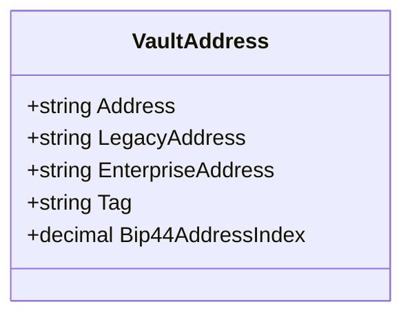

##### `AssetMapping` class diagram

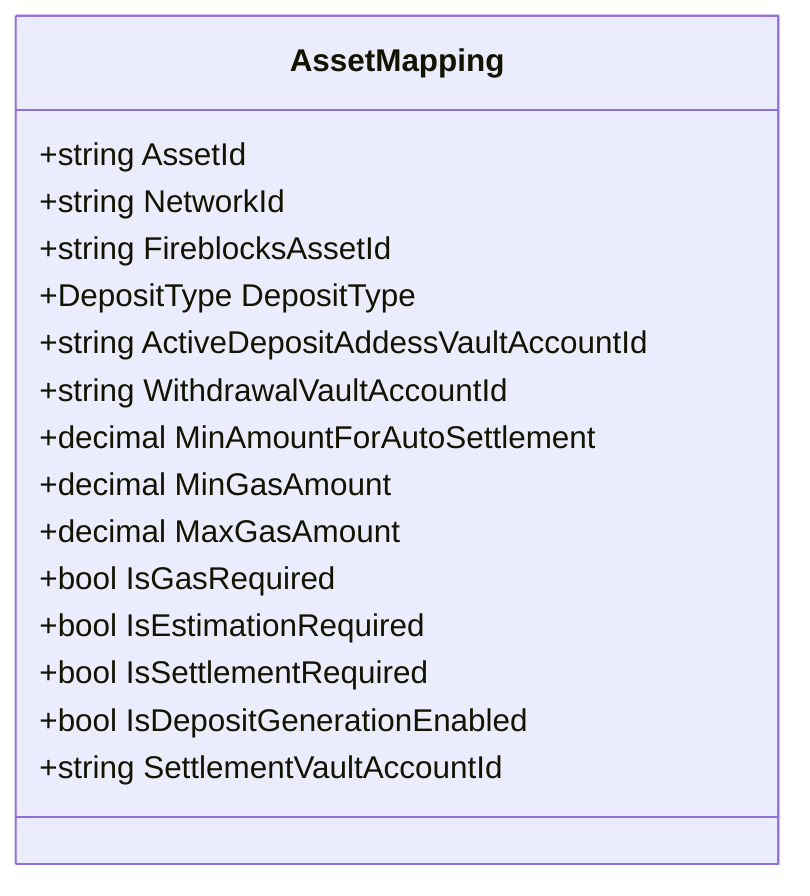

##### `DepositType` class diagram

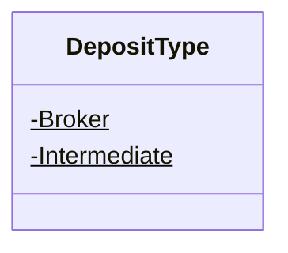

##### `ExchangeAccount` class diagram

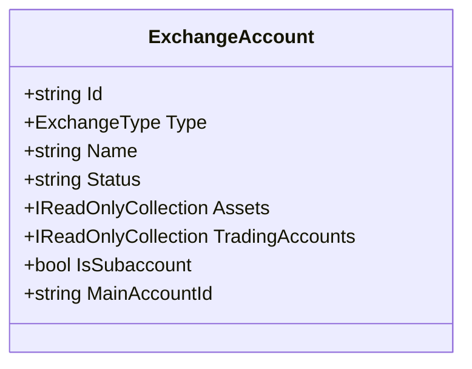

##### `ExchangeAsset` class diagram

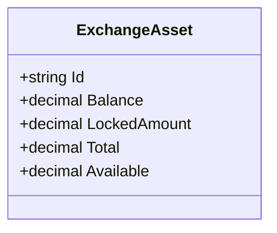

##### `ExchangeType` class diagram

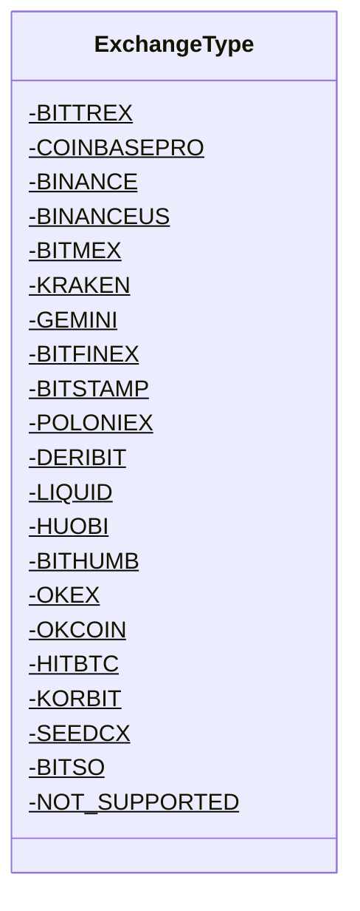

##### `TradingAccount` class diagram

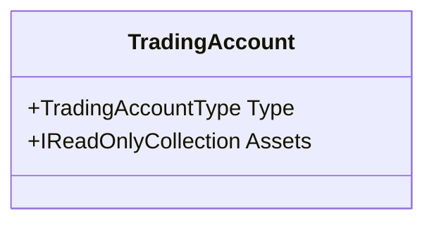

##### `TradingAccountType` class diagram

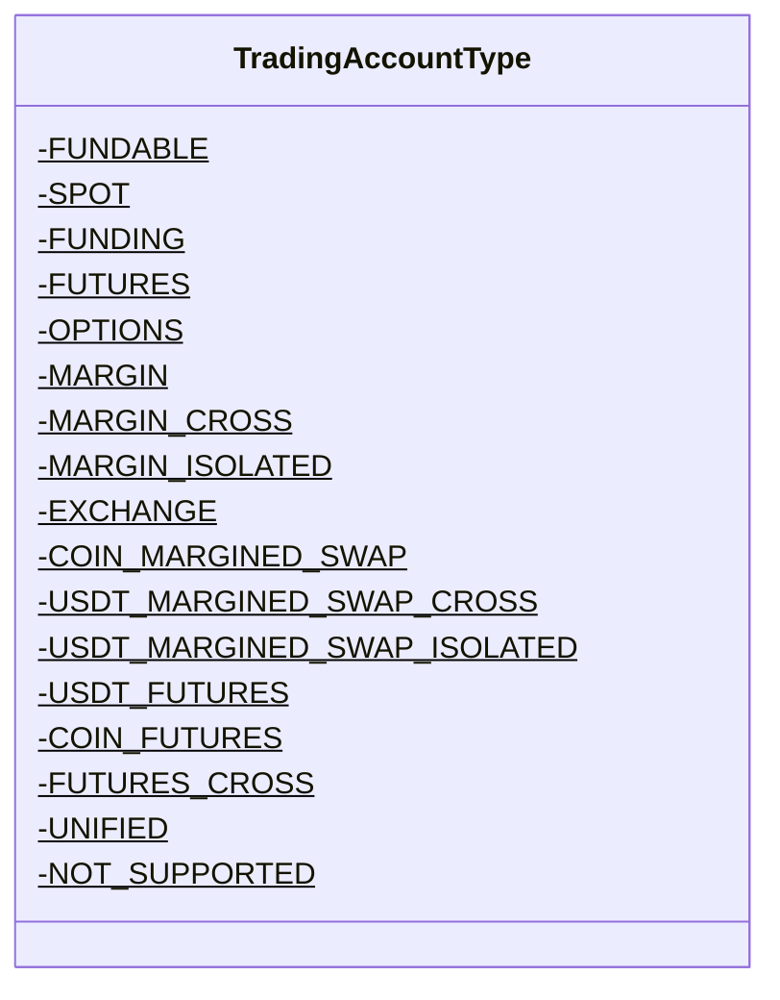

##### `AssetType` class diagram

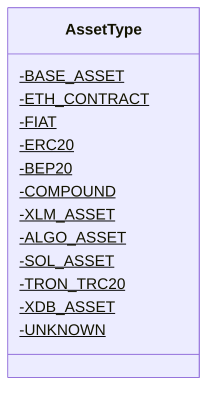

##### `SupportedAsset` class diagram

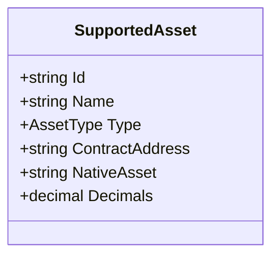

##### `TransactionHistory` class diagram

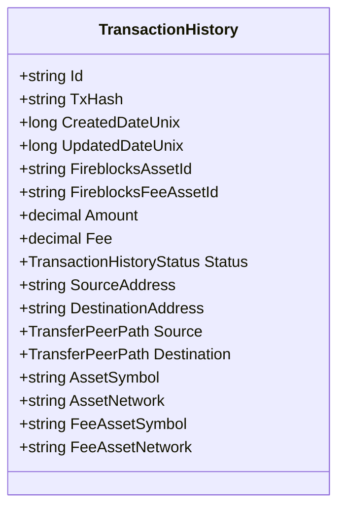

##### `TransactionHistoryStatus` class diagram

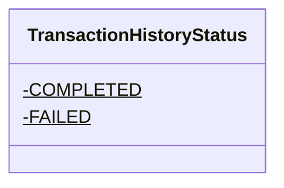

##### `TransferPeerPath` class diagram

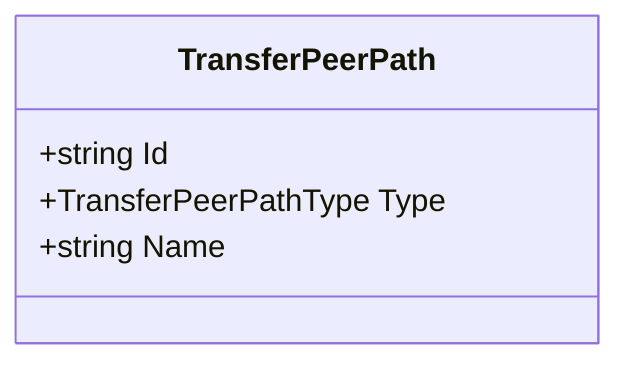

##### `TransferPeerPathType` class diagram

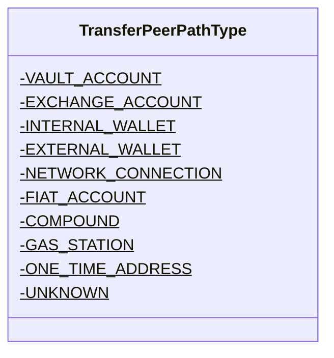

##### `VaultAccount` class diagram

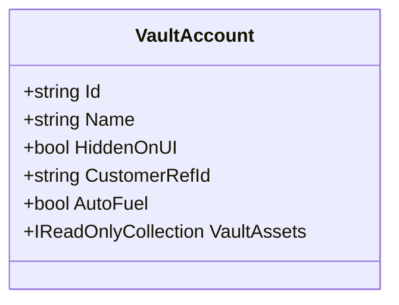

##### `VaultAsset` class diagram

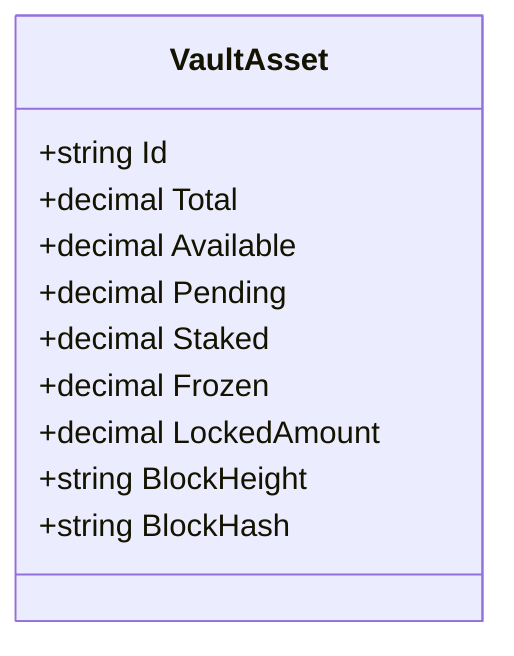

*This file is maintained by a bot.*

<!-- markdownlint-restore -->
